# Master flowchart — the chain of rules

> **Read this first.** Every other doc in this folder covers one layer of this chain in depth. This page is the join: session start → branch guard → delegate-or-not → worktree isolation → merge-back → test → verify → audit → commit → PR → cleanup, with every *enforcing* hook shown at the point it actually fires.

Two versions of the same diagram:

- **Below** — a Mermaid rendition. Renders natively on GitHub and most markdown viewers; text-diffable in git.
- [`master-flowchart.drawio`](master-flowchart.drawio) — the editable source. Open in [diagrams.net](https://app.diagrams.net) (File → Open) or the drawio VS Code extension if you want to rearrange or extend it visually.

Both are generated from the same audit and should be kept in sync manually — there's no build step converting one to the other.

> Everything in this diagram runs inside **one local Claude Code process on this machine**. MCP servers (`context7`, `mcp-bus`, `playwright`, etc.) are external tool providers any step may call into — see the `mcp-bus` note in Band 3 and the MCP list below. They don't add separate execution contexts to this chain.

```mermaid
flowchart TD
    subgraph Band1["Band 1 — Session Bootstrap"]
        Start(["Claude Code session launches"]) --> SS["SessionStart hooks fire:<br/>session_start.py detects stack + claims branch lock<br/>process_cleanup.py sweeps orphan processes"]
        SS --> D1{"CLAUDE.md exists?"}
        D1 -- No --> L1["Ask the user to describe the project,<br/>create CLAUDE.md later if they decline"]
        D1 -- Yes --> R1["Detect stack, invoke @load-project<br/>to brief available specialists"]
        L1 --> D2
        R1 --> D2
        D2{"Second session lands on<br/>same branch while first is alive?"}
        D2 -- Yes --> R2["session_start.py auto-creates a sibling<br/>worktree branch-sN, tells user to switch.<br/>Opt out via CLAUDE_WORKTREE_AUTO=0"]
    end

    subgraph Band2["Band 2 — Task Intake"]
        Task["User gives Claude a task"]
        Task --> D3{"First edit of this task<br/>on main or master?"}
        D3 -- Yes --> L3[["pretool_branch_guard.py BLOCKS<br/>until: git checkout -b type/slug"]]
        D3 -- No --> Route
        L3 --> Route
        Route["Subagent routing gate:<br/>handle in main session by default"]
    end

    D2 -- No --> Task
    R2 --> Task

    subgraph Band3["Band 3 — Execution Strategy: three lanes"]
        Route --> D4{"Delegate? needs Scale &gt;5 files,<br/>OR Independence review/audit,<br/>OR Parallelism, OR explicit<br/>/orchestrate or Spec Kit"}
        D4 -->|"No: Lane A, direct"| L4["Main session does the work directly"]
        D4 -->|Yes| Orch["/orchestrate routing table selects<br/>specialist agent(s) by domain + phase"]
        Orch --> D5{"2+ writing agents<br/>dispatched concurrently?"}
        D5 -->|"No: Lane B, sequential"| R5["Single Agent call, sequential,<br/>no isolation needed"]
        D5 -->|"Yes: Lane C, isolated parallel"| Hook[["pretool_task_isolation.py BLOCKS if:<br/>writing agent + run_in_background<br/>+ no isolation set to worktree"]]
        Hook --> Iso["Every concurrent writer gets<br/>isolation: worktree -- harness creates a<br/>temp worktree+branch per agent,<br/>max 4 concurrent, rest wave"]
        Iso -. "MCP, informational" .-> McpBus(["mcp-bus (services/mcp-bus, local SQLite):<br/>bus_post/bus_read shared channel,<br/>mem_set/mem_get shared memory<br/>across the isolated workers"])
        Iso --> Exit{"Agent made changes?"}
        Exit -- No --> Clean["Worktree auto-cleaned"]
        Exit -- Yes --> Return["Path + branch returned to caller"]
        Clean --> Merge
        Return --> Merge["Main session merges each branch back<br/>sequentially -- conflicts reported to<br/>the user, never auto-resolved"]
    end

    L4 --> Test
    R5 --> Test
    Merge --> Test

    subgraph Band4["Band 4 — Test and Verify"]
        Test["Run relevant tests -- per CLAUDE.md,<br/>after every code change. Tester agents<br/>scope to changed files, unit-first,<br/>sized timeout"]
        Test --> Verify["@code-plan-verifier -- read-only<br/>drift check vs plan/tasks, spec-kit flows"]
        Verify --> Audit["@gitignore-auditor + @secret-auditor --<br/>read-only staged-files scan, BEFORE commit"]
    end

    subgraph Band5["Band 5 — Commit"]
        Audit --> D6{"Plan-completion checkpoint --<br/>all tasks done + verified, or user<br/>says considered done?"}
        D6 -- Yes --> R6["Auto-commit immediately via<br/>git-identity wrapper, no ask"]
        D6 -- No --> L6["Show proposed commit message,<br/>wait for explicit user OK"]
        R6 --> Commit
        L6 --> Commit
        Commit["git-identity wrapper commits:<br/>enforces type colon subject, refuses<br/>main/master, local-only identity override"]
    end

    subgraph Band6["Band 6 — Push / PR and Wrap-up"]
        Commit --> D7{"User explicitly asked<br/>to push or open a PR?"}
        D7 -- No --> L7["Stop -- never push or PR<br/>without explicit ask"]
        D7 -- Yes --> R7["git push, then /pr drafts<br/>title+body, then gh pr create"]
        L7 --> End
        R7 --> End
        End["Stop hook nags on uncommitted changes.<br/>SessionEnd releases the branch lock<br/>+ sweeps orphan processes"]
        End --> Cleanup["After merge: delete merged local<br/>branches, prune stale worktrees"]
    end

    classDef hookBlock fill:#f8cecc,stroke:#b85450,color:#000;
    classDef decision fill:#fff2cc,stroke:#d6b656,color:#000;
    classDef terminal fill:#d5e8d4,stroke:#82b366,color:#000;
    classDef mcp fill:#e6f5ff,stroke:#6699cc,color:#000;
    class SS,L3,Hook hookBlock;
    class D1,D2,D3,D4,D5,D6,D7,Exit decision;
    class Start,End,Cleanup terminal;
    class McpBus mcp;
```

## MCP servers referenced above

Callable from any step in the chain; they're external tool providers, not separate execution contexts:

| Server | What it's for |
|---|---|
| `mcp-bus` | This repo, `services/mcp-bus`, local SQLite. Inter-agent message bus + shared memory + agent registry — used by isolated parallel workers in Band 3, Lane C. |
| `context7` | Live library/framework documentation lookup. |
| `microsoft-docs` | Azure / Microsoft Learn documentation. |
| `claude-in-chrome`, `playwright` | Browser automation. |
| `Slack`, `Vercel`, `Azure` | Team and cloud plugin integrations. |

Full registration and server list: [`global/MCP.md`](../global/MCP.md).

## Passive hooks not shown above

The diagram only shows hooks that **block** or **redirect** the flow. These fire on the same events but never change what happens next — they're bookkeeping:

| Hook | Event | What it records |
|---|---|---|
| `context_guard.py` | `UserPromptSubmit` | Opt-in advisory nudge to `/compact` when estimated context usage crosses a configured threshold. Never blocks. |
| `subagent_start.py` / `subagent_stop.py` | `PreToolUse(Task\|Agent)` / `SubagentStop` | Statusline "subagent running" chip + token count on completion. |
| `post_tool_use.py` | `PostToolUse(*)` | Per-session tool/agent counters for the statusline. |
| `write_audit.py` | `PostToolUse(Write\|Edit)` | Append-only forensic log of every file write. |
| `format_on_write.py` | `PostToolUse(Write\|Edit)` | Auto-runs `ruff format` / `biome format` / `dotnet format` on the just-written file if project config is found. |

Full detail on every hook, including these: [`hooks.md`](hooks.md).

## Where each stage is documented in depth

| Stage | Doc |
|---|---|
| Session bootstrap, branch-lock collision | [`hooks.md`](hooks.md) § SessionStart, [`architecture.md`](architecture.md) |
| Branch-before-work guard | [`hooks.md`](hooks.md) § PreToolUse (Write / Edit) |
| Delegate-or-not gate, routing table | [`orchestration.md`](orchestration.md) |
| Worktree isolation + merge-back | [`parallel-isolation.md`](parallel-isolation.md) — canonical source of the rule |
| Test / verify / audit / commit / PR sequencing | [`workflows.md`](workflows.md) — 8 canonical flows |
| Spec-kit gate criteria (contract-tests-first, parallel-isolation gate, etc.) | [`speckit.md`](speckit.md) |
| Commit identity + branch-refusal mechanics | [`git-policy.md`](git-policy.md) |

## Keeping this page accurate

This diagram was built by reading `global/settings.json`, every `global/hooks/*.py`, `global/agents/*.md`, `global/skills/**`, and `.specify/memory/constitution.md` directly — not by trusting the prose docs about them, several of which had drifted (see the PR that introduced this page for specifics). Re-verify against those sources, not against this diagram, when something looks off. The audit found and fixed:

- `hooks.md` documented `session-start.ps1` and `stop-session.ps1` — both are actually `.py`, and six wired hooks (`context_guard.py`, `pretool_branch_guard.py`, `subagent_start.py`, `post_tool_use.py`, `format_on_write.py`, `subagent_stop.py`) weren't documented at all.
- `speckit.md` said the Constitution Check must clear "all five" gates directly above a table listing six.
- `speckit.md` and `workflows.md` pointed only at `setup/settings-configurator-ui.py`, missing the now-recommended `./run` wizard entry point named in the root `CLAUDE.md`.

`orchestration.md`, `parallel-isolation.md`, and the agent registry were already accurate at audit time.
